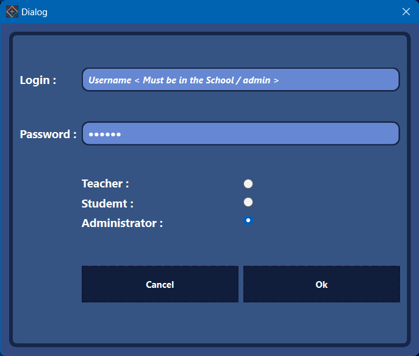
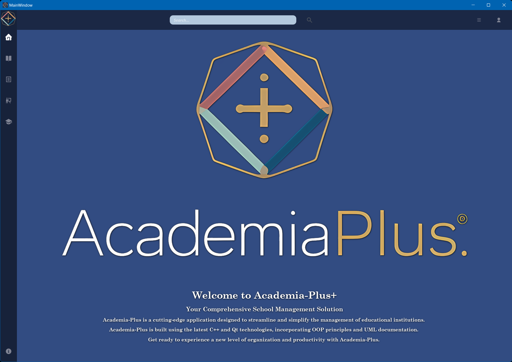
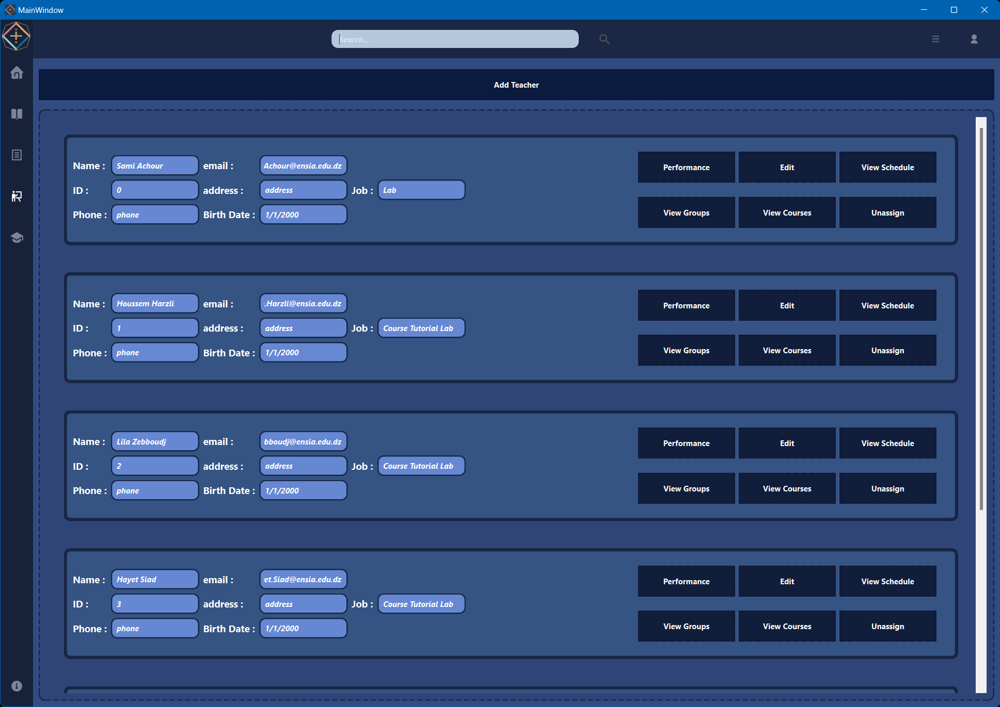
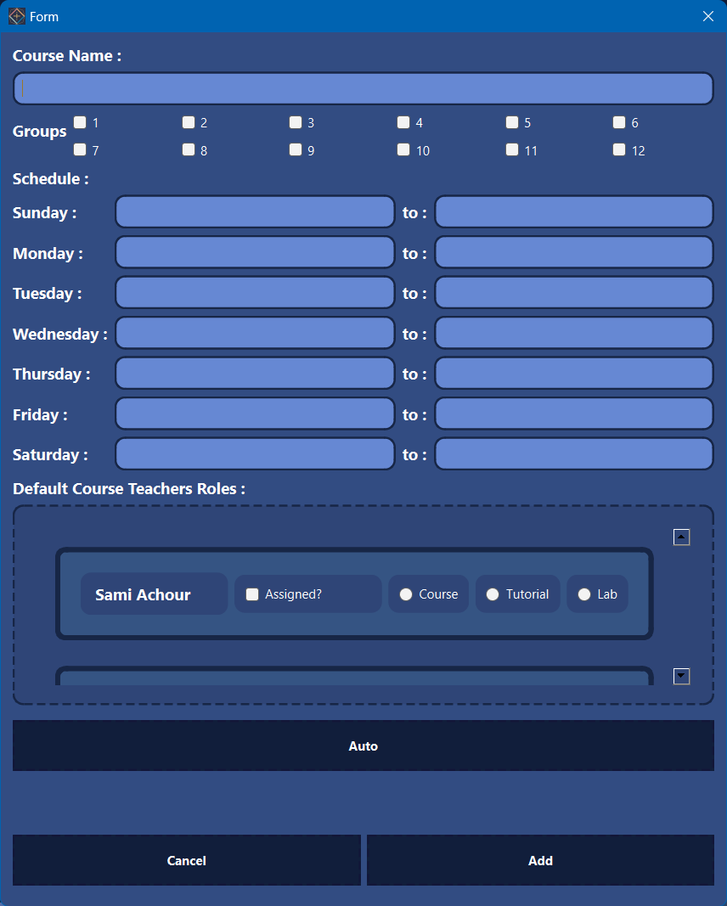
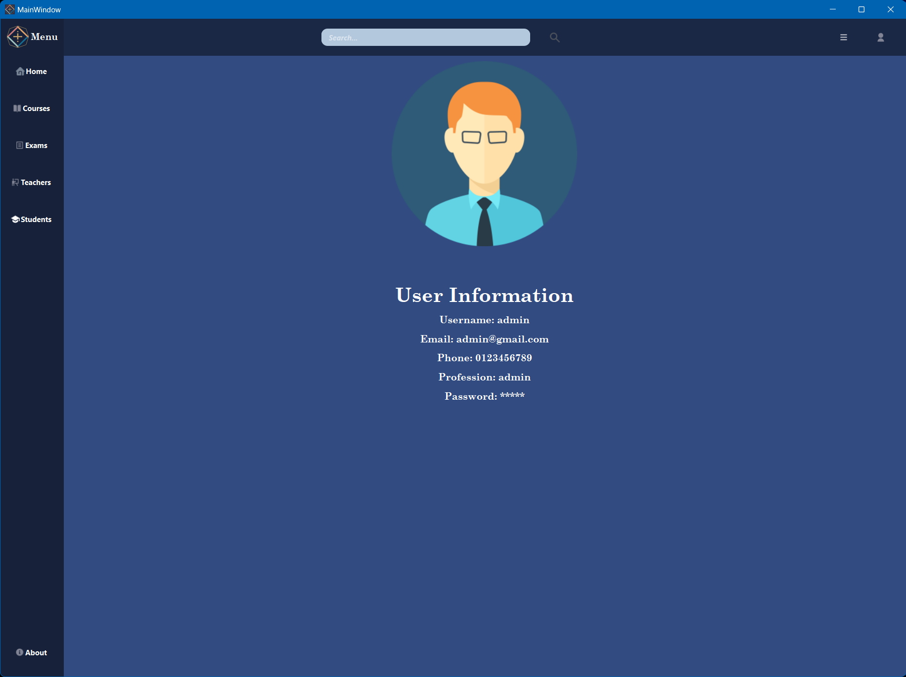
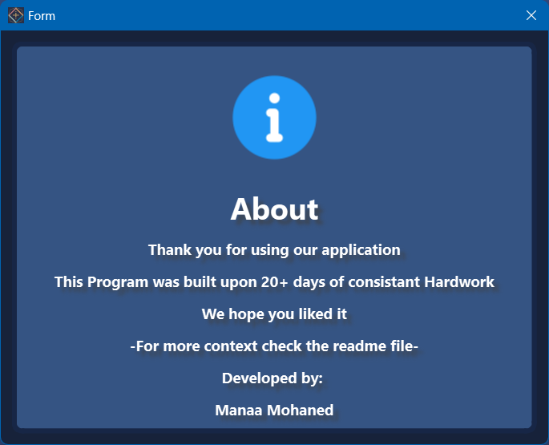
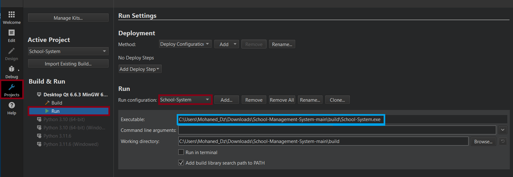

Academia Plus © 🏫
School-Management-System! 🚀

Prototype Demo: A C++ Qt application simulating a school environment.

Introduction 👋

Welcome to the School-Management-System project! This prototype, built with Qt C++, simulates a school system with students, teachers, exams, and courses. It was a 20-day, non-mandatory assignment focused on exploring how such a system could be structured. This is a demo, and it may be significantly reworked in the future.

Project Design 🎨

The project started with a day of interface design and class hierarchy planning. The core C++ functionality was completed quickly. The design aims for a sleek, minimalist, and modern user experience, despite some Qt limitations. The application dynamically adjusts layers and widgets to present information.

This project was experimental. Different approaches (arrays, vectors, pointers, extern functions) were used across classes to explore their potential. This led to a less consistent codebase but provided valuable learning. The project also uses local storage with C++ file handling - No Internet Required!

Project Journey 🗺️
Timeline ⏳

Completed in 20 days, but with extensive rework due to evolving requirements and challenges. What started simply became more complex with added features and problem-solving.

Challenges and Motivation 💪

Major challenges included:

Switching from arrays to vectors mid-project.

Dynamically allocating resources.

Adapting functions to Qt.

Redesigning for multiple teacher roles and student year levels.

Shifting the scheduling system to be course-focused.

These challenges provided a deep understanding of software development complexities.

Rework Highlights ♻️

Some features were scaled back or removed:

Icon customization for courses, teachers, and students (UI limitations).

Easter eggs and personalized features.

Simplified scheduling system.

Streamlined course details and exam types.

Features like multi-year group management and manual data saving/loading were omitted due to complexity.

Lessons Learned 📚

Key takeaways:

Lesson 1: Careful planning reduces rework. 📝

Lesson 2: Concise, high-quality code is better than large, buggy code. 💎

Lesson 3: Avoid unnecessary pointer complexity. 🚫🔗

Lesson 4: More planning time saves development and debugging time. ⏰

Conclusion 🎉

The School-Management-System was a valuable design and problem-solving exercise. It involved challenges and reworks, but the experience gained was substantial. As a prototype, it served its purpose as a testing ground, laying the foundation for future projects.

Feel free to explore the code and reach out with questions or suggestions!

Screenshots 🖼️
Login Window

Use admin|admin, or a Name|Password from the database

Home Page

Home Page with the Main Logo and homework

Menu Illustation

Example Menu (Teachers), all features implemented

Adding a new member/Element!

Depends on member type: Teacher/Student/Course/Exam

User Credentials

Simple UI showcasing user information

About Context window

Simple about window

Running the Application on Qt

Set the project build location after downloading the zip file
